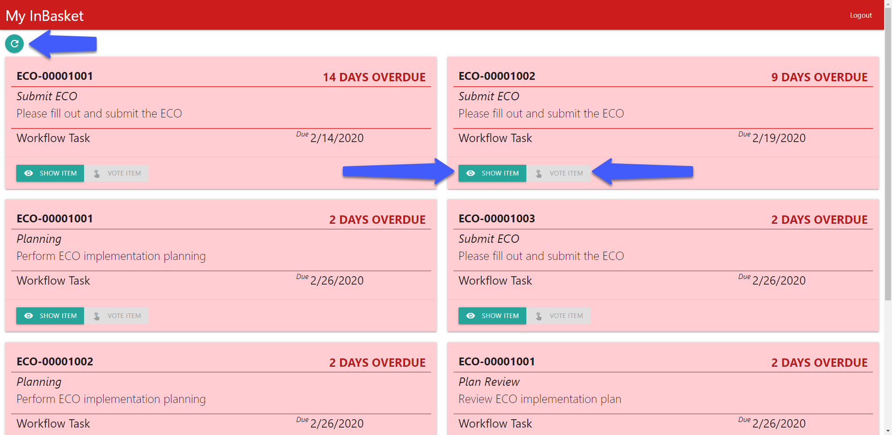
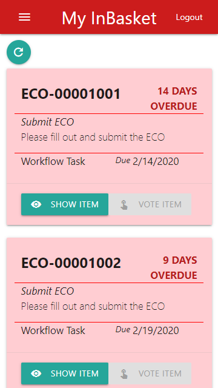

# PWA with CUI Sample

This project demonstrates one implementation for how to configure the UI of an external application using the Configurable User Interface data model within the Innovator database. This app queries for specific CUI items in the database and then uses the information stored in that item in order to render buttons to the screen.

This sample app will populate a list of cards for each InBasket task a user has assigned to them. Users can view details of the Work Item and Vote on the InBasket. The buttons that handle this functionality are populated from Innovator. You can see these buttons highlighted below.

Additionally, as this is a web app, the interface is also responsive based on the screensize. Below you can see what this app looks like on a smaller phone screen.

## Project Details

#### Built Using
Aras 12.0 SP4

#### History
Release | Notes
--------|--------
[v1.0.0](https://github.com/ArasLabs/pwa-with-cui-sample/releases/tag/v1.0.0) | Initial Release.

#### Supported Aras Versions
Project | Notes
--------|--------
[v1.0.0](https://github.com/ArasLabs/pwa-with-cui-sample/releases/tag/v1.0.0) | 12.0 SP4

## Installation

#### Important!
**Always back up your code tree and database before applying an import package or code tree patch!**

### Pre-requisites

1. Aras Innovator installed (version 12.0 SPX preferred)
2. Aras Package Import tool
3. pwa-with-cui-sample import package

#### Database Installation

1. Backup your database and store the BAK file in a safe place
2. Open up the Aras Package Import tool
3. Enter your login credentials and click **Login**
    * _Note: You must login as root for the package import to suceed!_
4. Enter the package name in the TargetRelease field
    * Optional: Enter a description in the Description field
5. Enter the path to your local `..\pwa-with-cui-sample\Import\imports.mf` file in the Manifest File field
6. Select **PWA** in the Available for Import field
7. Select Type = **Merge** and Mode = **Thorough Mode**
8. Click **Import** in the top-left corner
9. Close the Aras Package Import tool

#### PWA Installation

1. Open up your IIS Manager
2. In the Connections panel, expand down to your Innovator application
   1. By default this is, **MACHINE NAME > Sites > Default Web Site > InnovatorServer**
3. Right click on the top-level Innovator application and click **Add Application**
4. Fill in the details of this new app
   1. Alias - **InBasket**
   2. Physical Path - `..\pwa-with-cui-sample\PWAApp\`
5. Click OK

You are now ready to try out this sample PWA.

## Usage

1. Connect to the PWA using the ALias you set in the installation steps above
   1. By default, `http://localhost/InnovatorServer/InBasket`
2. Fill in the login information for a user with assigned InBasket Tasks
3. Wait for the list of cards to populate
4. Click **View Item** to see the details of the Work Item
5. Click **Vote Item** to bring up a dialog with the activity tasks
6. Click the Refresh button to reload the grid

## Credits

Original Aras community project written by Volodymyr Shyshykivski (@VolodymyrSh) and Christopher Gillis (@cgillis-aras) at Aras Corp.

Documented and published by Christopher Gillis for Aras Labs. @cgillis-aras

## License

Aras Labs projects are published to Github under the MIT license. See the [LICENSE file](./LICENSE) for license rights and limitations.